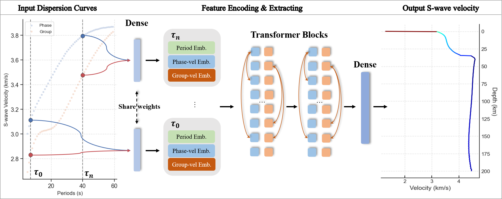

<div align="center">
  
</div>
<br/>
<div align="center">
  
  
</div>
<div align="center">
  
  
  
</div>
<h2 align="center">DispFormer: A Pretrained Transformer Incorporating Physical Constraints for Dispersion Curve Inversion</h2>

---

- [🔥 News](#-news)
- [📚 Introduction](#-introduction)
- [🔧 Installation](#-installation)
- [🎬 Examples](#-examples)
  - [(1) Datasets Overview](#1-datasets-overview)
  - [(2) Pre-training](#2-pre-training)
  - [(3) Zero-shot Inversion](#3-zero-shot-inversion)
  - [(4) Few-shot Inversion](#4-few-shot-inversion)
  - [(5) Real-Case Study](#5-real-case-study)
- [📧 Contact \& Citation](#-contact--citation)

---

### 🔥 News
- **2025/08/12**: 🎉 **DispFormer** has been **accepted** for publication in [*JGR: Machine Learning & Computation*](https://agupubs.onlinelibrary.wiley.com/journal/29935210).
- **2025/08/01**: 📦 **OpenSWI** — A massive-scale benchmark dataset for surface wave dispersion curve inversion — has been released. Related [main page](https://liufeng2317.github.io/OpenSWI/), [codes](https://github.com/liufeng2317/OpenSWI) and [dataset](https://huggingface.co/datasets/LiuFeng2317/OpenSWI) are now available.
- **2025/01/08**: 📄 **DispFormer** preprint is available on [*arXiv*](https://arxiv.org/abs/2501.04366).

---

### 📚 Introduction

&emsp;&emsp;DispFormer is a transformer-based neural network for inverting S-wave velocity ($v_s$) profiles from Rayleigh-wave phase and/or group dispersion curves. It processes data independently at each period, **allowing it to handle datasets with varying lengths and missing data without needing alignment or network modifications**. The model works well in zero-shot and few-shot learning scenarios, making it highly efficient and accurate for real-world applications, even when data is sparse or noisy.

<p align="center">
  
</p>

<p align="center">
  
</p>

<p align="center">
  
</p>

****

### 🔧 Installation
(1) Clone the repository:
```shell
git clone https://github.com/liufeng2317/DispFormer 
cd DispFormer
```

(2) requirements
- Python >= 3.8
- PyTorch >= 1.9.0
- Other dependencies listed in `requirements.txt`
```shell
pip install -r requirements.txt
```

(3) Introduction of the file list
- `DispFormer/model/dispformer.py`: Contains the model architecture for DispFormer.
- `DispFormer/dataloader.py`: Implements dataset handling using `torch.utils.data.Dataset`.
- `DispFormer/dataloader_pretrain.py`: Provides specialized datasets for pre-training purposes.
- `DispFormer/data_augmentation.py`: Includes functions for dataset augmentation (e.g., Gaussian noise, masking, etc.).
- `DispFormer/plots.py`: Contains functions for generating result visualizations.

****

### 🎬 Examples

#### (1) Datasets Overview

The **LITHO1.0** global synthetic dataset is used for pre-training the model, while the **Central and Western US Dataset (CWD)** and **Continental China Dataset (CCD)** are used to validate the effectiveness of the zero-shot and few-shot strategies. Finally, the datasets retrive from **China Seismological Reference Model (CSRM)** are used to test the model. The datasets can be retrieved from the following Zenodo link: [https://zenodo.org/records/14619577](https://zenodo.org/records/14619577)

| **Dataset**                          | **Samples** | **Period** | **Max Depth** | **Tags**   | **Reference**                                                                                   |
|--------------------------------------|-------------|------------------|-------------------|------------|------------------------------------------------------------------------------------------------|
| **LITHO1.0**                         | 40,962      | 1-100 s          | 200 km            | Global Synthetic  | [Masters et al., 2014](https://doi.org/10.1002/2013JB010626)                                     |
| **CWD**   | 6,803       | 10-60 s          | 120 km            | Local Synthetic  | [Shen et al., 2013](https://doi.org/10.1029/2012JB009602)                                       |
| **CCD**        | 4,527       | 5-80 s           | 200 km            | Local Synthetic  | [Shen et al., 2016](https://doi.org/10.1093/gji/ggw175)                                         |
| **CSRM** | 12,705  | 8-70 s           | 120 km            | Local Real       | [Xiao et al., 2024](https://doi.org/10.1029/2024JB029520)                                       |

<details>
  <summary>Synthetic-data Overview (different period range)</summary>
  <p align="center">
  
  </p>
</details>

<details>
  <summary>Real-data Overview (varying period range, missing data, low signal-to-noise ratio)</summary>
  <p align="center">
  
  </p>
</details>

****

#### (2) Pre-training

We pre-train the **DispFormer** model using the **LITHO1.0** global synthetic dataset, which includes a variety of seismic data. The pre-training process consists of two approaches:

1. **Without data augmentation**: Training on the original LITHO1.0 dataset to learn the model structure.  
   - Training script: [01_1_LITHO1.py](./Script/ModelDesign/pre-training/01_1_LITHO1.py)

2. **With data augmentation**: Training on augmented datasets that include techniques like noise addition and masking.  
   - Training script: [01_2_LITHO1_dataAug.py](./Script/ModelDesign/pre-training/01_2_LITHO1_dataAug.py)

Once pre-trained, the model can be applied to datasets of varying lengths, including **CWD** and **CCD** datasets, to test its **zero-shot** performance.

****

#### (3) Zero-shot Inversion

DispFormer support directly applied the pre-trained model to regional datasets (CWD & CCD). The results show that the **zero-shot** strategy yields errors that are closely centered around zero, with few outliers, outperforming the interpolated reference model from LITHO1.0. However, considering domain gap between the training and testing datasets, zero-shot performance may not always surpass traditional optimization methods like global search. Therefore, we propose using the **zero-shot DispFormer** as an **initial model generator** to enhance traditional inversion algorithms.

<details>
  <summary>Click to view Zero-Shot results CWD Dataset (Shen et al., 2013) results</summary>
  <p align="center"></p>
</details>

<details>
  <summary>Click to view Zero-Shot results on CCD Dataset (Shen et al., 2016) results</summary>
  <p align="center"></p>
</details>


****

#### (4) Few-shot Inversion

When limited labeled data is available for fine-tuning the pre-trained model, the results can surpass traditional inversion methods. The results from the CWD and CCD datasets show that even with just a few dozen labels, fine-tuning can achieve performance comparable to global search algorithms. More details can be found in the following scripts:
* [Fine-tuning with 10 CWD samples](./Script/ModelDesign/fine-tuning/Shen2013/01_1_pretrain_Litho1_train_Shen2013-sparse500.py)
* [Fine-tuning with 108 CWD samples](./Script/ModelDesign/fine-tuning/Shen2013/01_1_pretrain_Litho1_train_Shen2013-sparse300.py)
* [Fine-tuning with 36 CWD samples](./Script/ModelDesign/fine-tuning/Shen2016/01_1_pretrain_Litho1_train_Shen2016-sparse100.py)
* [Fine-tuning with 180 CWD samples](./Script/ModelDesign/fine-tuning/Shen2016/01_1_pretrain_Litho1_train_Shen2016-sparse20.py)

<details>
  <summary>Click to view Few-Shot results on CWD Dataset (Shen et al., 2013)</summary>
  <p align="center"></p>
</details>

<details>
  <summary>Click to view Few-Shot results on CCD Dataset (Shen et al., 2016)</summary>
  <p align="center"></p>
</details>


****

#### (5) Real-Case Study

Real-world data often face challenges such as varying data ranges, missing data, and low signal-to-noise ratios, which can hinder the direct application of CNN/FNN-based networks. DispFormer, however, can be applied to real data without requiring modifications to the network structure or alignment between observation and training datasets. Inversion results show that zero-shot DispFormer provides acceptable results for most major structures. Additionally, after fine-tuning with a small amount of labeled data, the few-shot DispFormer generates results that are comparable to or even exceed the reference model. In terms of data error, the Few-Shot DispFormer outperforms the reference model.

<details>
  <summary>Click to view inversion results on CSRM (Xiao et al., 2024)</summary>
  <p align="center"></p>
</details>

<details>
  <summary>Click to view data-residual comparison</summary>
  <p align="center"></p>
</details>


****

### 📧 Contact & Citation
This project was developed by Feng Liu at Shanghai Jiao Tong University (SJTU) and Shanghai Artificial Intelligence Laboratory (PJLAB). For any inquiries, please contact Liu Feng via email [liufeng2317@sjtu.edu.cn](liufeng2317@sjtu.edu.cn).

If you find DispFormer or its related publicly available datasets useful in your research, please cite the following papers
* [DispFormer](https://arxiv.org/abs/2501.04366)
```
Liu, F., Deng, B., Su, R., Bai, L. & Ouyang, W.. DispFormer: Pretrained Transformer for Flexible Dispersion Curve Inversion from Global Synthesis to Regional Applications[J]. arXiv preprint arXiv:2501.04366, 2025.
```
* [Surface Wave Dispersion Benchmark Datasets](https://zenodo.org/records/14619577):
```
Liu, F. (2025). Surface Wave Dispersion Benchmark Datasets: Synthetic and Real-World Cases (1.0) [Data set]. Zenodo. https://doi.org/10.5281/zenodo.14619577
```

* and/or the software
```
@software{DispFormer_LiuFeng_2024,
  author       = {Feng Liu},
  title        = {DispFormer},
  month        = January,
  year         = 2024,
  version      = {v1.0.0},
}
```